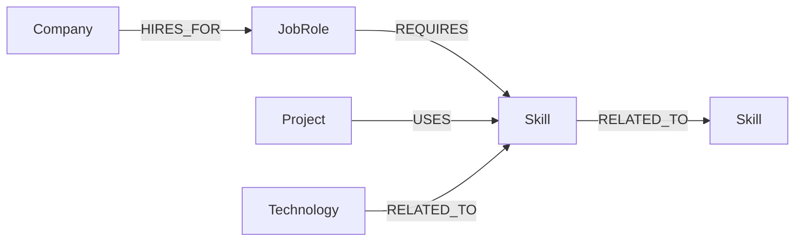

# DevPath — Developer Career & Skill Graph

DevPath is a small graph-powered career exploration application that helps users explore career paths, skills, roles, projects, and their relationships through an interactive knowledge graph.

It lets a user explore the relationships between:

**Job Roles → Skills → Related Skills → Projects → Companies**

The application uses CognoDB as the graph database and the official Neo4j JavaScript driver over Bolt.

### Live Link:- https://dev-path-graph.vercel.app

## Why a graph database?

This use case is relationship-heavy. A user is not only asking "which skills belong to this job?" but also:

- Which related skills should I learn next?
- Which projects use the skills required by this role?
- Which companies hire for roles that require a particular skill?
- What connected learning path can take me from one skill to another?

These questions naturally involve multi-hop traversal. In a relational design, the same questions would often require several junction tables and joins. In a graph, the relationships are first-class data and can be traversed directly with Cypher.

## Graph model



### Nodes

- `JobRole`: software roles such as Backend Developer.
- `Skill`: skills such as Node.js, REST APIs and Docker.
- `Project`: realistic projects that use technical skills.
- `Company`: companies associated with job roles.
- `Technology`: technologies that can be related to skills.

### Relationships

- `(:JobRole)-[:REQUIRES]->(:Skill)`
- `(:Skill)-[:RELATED_TO]->(:Skill)`
- `(:Project)-[:USES]->(:Skill)`
- `(:Company)-[:HIRES_FOR]->(:JobRole)`
- `(:Technology)-[:RELATED_TO]->(:Skill)`

## Features

- Search and explore skills.
- Inspect job roles and their required skills.
- Discover related skills through graph traversal.
- Find projects matching a job role's skills.
- Find companies associated with a role.
- Demonstrate multi-hop Cypher traversals.
- Loading, empty and error states.
- Seed script with realistic graph data.
- Environment-based database credentials.

## Project structure

```text
devpath-graph/
├── server/
│   ├── config/
│   │   └── db.js
│   ├── controllers/
│   │   └── graphController.js
│   ├── queries/
│   │   └── graph.cypher
│   ├── routes/
│   │   └── graphRoutes.js
│   ├── seed/
│   │   └── seed.js
│   ├── app.js
│   └── package.json
├── client/
│   ├── src/
│   │   ├── components/
│   │   │   ├── DetailPanel.jsx
│   │   │   ├── GraphCard.jsx
│   │   │   └── StatCard.jsx
│   │   ├── App.jsx
│   │   ├── api.js
│   │   ├── index.css
│   │   └── main.jsx
│   ├── index.html
│   ├── package.json
│   └── vite.config.js
├── .env.example
├── .gitignore
└── package.json
```

## 1. Create the CognoDB instance

Create a free instance from the CognoDB Cloud console.

You will receive:

```text
COGNODB_URI=bolt+s://<instance-id>.databases.cognodb.cloud
COGNODB_USERNAME=cognodb
COGNODB_PASSWORD=<generated-password>
```

The password is displayed only once, so save it securely.

## 2. Configure environment variables

Copy `.env.example` to `.env` inside `server/`:

```bash
cp .env.example server/.env
```

Then fill in the CognoDB credentials.

Never commit `.env`.

## 3. Install dependencies

From the project root:

```bash
npm install
npm install --prefix server
npm install --prefix client
```

## 4. Seed the graph

```bash
npm run seed
```

This creates the constraints and realistic graph data.

## 5. Run the application

```bash
npm run dev
```

The API runs on `http://localhost:5000` and Vite runs on `http://localhost:5173`.

## Main Cypher queries

### Required skills for a role

```cypher
MATCH (j:JobRole {name: $role})-[:REQUIRES]->(s:Skill)
RETURN s.name AS skill, s.category AS category
ORDER BY category, skill
```

### Multi-hop related skills

```cypher
MATCH (j:JobRole {name: $role})
      -[:REQUIRES]->(s:Skill)
      -[:RELATED_TO]->(related:Skill)
RETURN DISTINCT related.name AS skill,
       related.category AS category
ORDER BY category, skill
```

This traverses:

```text
JobRole → Skill → Related Skill
```

### Projects connected to a role

```cypher
MATCH (j:JobRole {name: $role})
      -[:REQUIRES]->(s:Skill)
      <-[:USES]-(p:Project)
RETURN p.name AS project,
       p.description AS description,
       collect(DISTINCT s.name) AS matchingSkills
ORDER BY size(matchingSkills) DESC, project
```

This is useful because a project is connected to a role indirectly through shared skills.

### Companies hiring for a role

```cypher
MATCH (c:Company)-[:HIRES_FOR]->(j:JobRole {name: $role})
RETURN c.name AS company,
       c.industry AS industry
ORDER BY company
```

All application queries use parameters rather than string-concatenated Cypher.

## API

| Method | Endpoint                | Purpose               |
| ------ | ----------------------- | --------------------- |
| GET    | `/api/health`           | Database health check |
| GET    | `/api/overview`         | Graph statistics      |
| GET    | `/api/roles`            | List job roles        |
| GET    | `/api/roles/:role`      | Role details          |
| GET    | `/api/skills/search?q=` | Search skills         |
| GET    | `/api/skills/:skill`    | Skill details         |
| GET    | `/api/graph/role/:role` | Connected graph data  |

## Error handling

The server returns JSON errors and the frontend displays a database/application error state rather than failing silently.

## Deployment

### Backend

Deploy `server/` to a Node-compatible host such as Render or Railway.

Set:

```text
COGNODB_URI
COGNODB_USERNAME
COGNODB_PASSWORD
CLIENT_ORIGIN
PORT
```

### Frontend

Deploy `client/` to Vercel or another static host.

Set:

```text
VITE_API_URL=https://<your-backend>/api
```

## Screen recording


